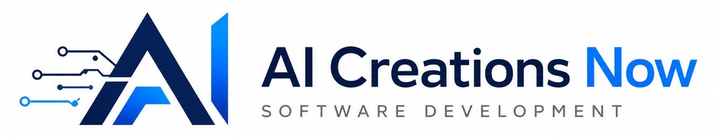

  

<h1 align="center">AI Creations Now Software Development</h1>

<strong>Windows software, network engineering and AI infrastructure consulting.</strong>

  <a href="https://aicreatenow.com/">Company website</a> ·
  <a href="https://aicreatenow.com/software.html">Software catalog</a> ·
  <a href="https://results.aicreatenow.com/">Benchmark Results Center</a>

**AI Creations Now Software Development** is based in Melville, New York. We build focused Windows utilities and performance tools alongside our network engineering, AI infrastructure consulting and custom software work.

## Featured: AI Now Bench 7

**A broader view of your PC.** Measure CPU, graphics, memory, storage, AI compute and real-world workloads with 63 scored results. The complete Standard benchmark is free, with local reports and optional public system comparisons.

[Explore AI Now Bench 7](https://github.com/aicreatenowdom/ai-now-bench-7) · [Download for Windows](https://ainowbench.com/download.html) · [Compare systems in the Results Center](https://results.aicreatenow.com/explore)

## Featured: Wi-Fi Commander

**Your home. Your network. In focus.** Explore Wi-Fi and mesh coverage, check Internet health, monitor bandwidth, and inspect LAN devices and ports from a Windows PC. Version 2.1.1 includes nine focused Network / Internet Tools.

[Explore Wi-Fi Commander](https://github.com/aicreatenowdom/wifi-commander) · [Product details and two-day trial](https://aicreatenow.com/WiFiCommander.html) · [Privacy policy](https://aicreatenow.com/WiFiCOMPrivacy.html)

Free 48-hour trial; $4.99 lifetime license for one computer, with no subscription. See the product page for requirements and current display compatibility notices.

## Featured: Rift Conduit

**A direct line to your own Windows storage.** Reach files on your Windows PC or server through encrypted SFTP, using your preferred file browser or remote-drive client. Manage incoming IPv4 settings, account creation and access controls from one compact interface.

[Explore Rift Conduit](https://github.com/aicreatenowdom/rift-conduit) · [Official website](https://riftconduit.com/) · [Download and two-day trial](https://riftconduit.com/download.html) · [Connection guide](https://riftconduit.com/connection-guide.html)

Free 48-hour trial; **[$7.99 lifetime license](https://buy.stripe.com/6oU7sN0JB5l66c40Fw5kk0d)** for the activated computer, including lifetime technical support and upgrades. A separately installed SFTP client and reachable network connection are required. [Privacy policy](https://riftconduit.com/privacy.html).

## Free software

| Project | What it does | Availability |
| --- | --- | --- |
| [AI Now Bench 7](https://github.com/aicreatenowdom/ai-now-bench-7) | 63 scored results across six PC performance categories, with reports and system comparisons. | Complete Standard benchmark is free. Optional Advanced Pro keys have free and priority delivery options. |
| [Azure Artifact Signing Tool](https://github.com/aicreatenowdom/azure-artifact-signing-tool) | A guided Windows interface for signing and verifying files through your Microsoft Azure Artifact Signing account. | Free portable utility; existing eligible Microsoft signing resources required. |
| [PowerShell Script Runner](https://github.com/aicreatenowdom/powershell-script-runner) | Launch local PowerShell scripts in an elevated console that stays open, with recent-script history. | Free signed portable utility. |
| [HW Info 64 Profile Loader](https://github.com/aicreatenowdom/hwinfo64-sensor-layout-profile-loader) | Save and switch ten HWiNFO64 sensor layouts, including a protected stock profile. | Free; HWiNFO64 is required separately. |
| [Moonlight / Sunshine Companion](https://github.com/aicreatenowdom/moonlight-sunshine-companion) | Capture client and host evidence to investigate streaming latency, stutters and connection problems. | Free email delivery within 24 hours, or optional $5 donation for immediate delivery through the product page. |

## Free trials

| Project | What it does | Trial and license |
| --- | --- | --- |
| [Rift Conduit](https://github.com/aicreatenowdom/rift-conduit) | Encrypted SFTP access to files on your Windows PC or server, using your preferred client. | 2-day trial; $7.99 lifetime license for the activated computer, including lifetime support and upgrades. |
| [Wi-Fi Commander](https://github.com/aicreatenowdom/wifi-commander) | Wi-Fi and mesh analysis, Internet health, bandwidth, LAN and port monitoring, plus network diagnostic tools. | 2-day trial; $4.99 lifetime license for one computer. |
| [AOL Mail Relay System](https://github.com/aicreatenowdom/aol-mail-relay) | Forward eligible new AOL Inbox messages from an awake Windows computer while preserving the originals. | 3-day trial; $5 lifetime license for one computer. |
| [Automated Backup Packager](https://github.com/aicreatenowdom/automated-backup-packager) | Schedule standard ZIP backups of selected Windows files and folders. | 15-day trial; $3.99 lifetime license for one computer. |

## Paid products

| Project | What it does | Purchase and delivery |
| --- | --- | --- |
| [Cloudflare Analytics Reporter](https://github.com/aicreatenowdom/cloudflare-analytics-reporter) | Turn website and R2 delivery analytics into scheduled HTML emails, local PDFs and rolling history. | $39.99 lifetime license for one computer; software and license emailed after purchase through the official product page. |
| [IIS Monitor](https://github.com/aicreatenowdom/iis-monitor) | View selected IIS websites, traffic, server resources and detailed monitoring reports. | $29.99 lifetime license for one computer; software and license emailed after purchase through the official product page. |

## Engineering services

We provide network engineering, AI compute and data-center infrastructure assessments, system optimization and custom software development. We support national and international projects, with local IT services for homes and businesses on Long Island.

[Explore our services](https://aicreatenow.com/services.html) · [Meet founder Dominick Strippoli](https://aicreatenow.com/owner.html) · [Contact us](mailto:info@aicreatenow.com)

## Product support

For product help, licensing and delivery questions, email **[info@aicreatenow.com](mailto:info@aicreatenow.com)** or call **1-866-315-4750**. Each product repository links to its official downloads, documentation and support details.

These repositories provide product documentation and artwork. The Windows applications are proprietary; their source code is not included. Free software and trial availability do not imply an open-source license. Please use each product's official download or purchase route.

---

<a href="https://aicreatenow.com/">AI Creations Now</a> · <a href="https://ainowbench.com/">AI Now Bench 7</a> · <a href="https://riftconduit.com/">Rift Conduit</a> · <a href="https://results.aicreatenow.com/">Results Center</a>

